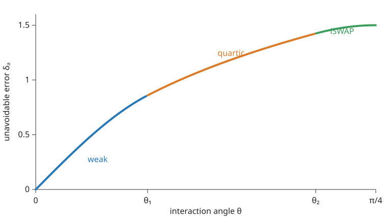

# Quantum Directional Signalling

[](https://github.com/richorama/quantum-directional-signalling/actions/workflows/tests.yml)

Exact diamond-norm evaluations of directional signalling for continuous
bipartite unitary families.

For a unitary $U$ on $A\otimes B$, the project studies

$$
\delta_A(U)=\inf_{\mathcal E\ \mathrm{CPTP}}
\left\|\operatorname{Tr}_B\operatorname{Ad}_U
-\mathcal E\operatorname{Tr}_B\right\|_\diamond .
$$

This asks how well the reduced output on $A$ can be predicted from the
reduced input on $A$ alone, even when the input is correlated with hidden
system $B$ and an arbitrary reference.

## Plain-language picture

Imagine two quantum objects, A and B, interact. You then discard B and try to
describe A using only what was initially known about A. That description can
fail because B carried hidden information that affected A.

$\delta_A(U)$ is the smallest unavoidable worst-case error, even after
choosing the best possible A-only rule. Zero means A has autonomous dynamics;
a larger value means B can signal more strongly into A. The diamond norm makes
this an adversarial test that also permits correlations with an external
reference.

The main qualitative result is that the best simplified rule can change as
the interaction gets stronger. For partial SWAP it eventually becomes better
to add deliberate noise than to pretend A evolved unchanged. For XY the exact
curve has three regimes:



## Results

- **Two-qubit Ising:** for $U_\theta=e^{-i\theta Z\otimes Z}$,
  $\delta_A(U_\theta)=|\sin 2\theta|$.
- **Partial SWAP in dimension $d$:** the optimization reduces exactly to one
  depolarizing parameter. For
  $\sin\phi\le (d^2-3)/(d^2-1)$,
  $\delta_A(U_\phi)=2\sin\phi$; at SWAP,
  $\delta_A=2(1-1/d^2)$.
- **Two-qubit XY/iSWAP:** the weak branch is
  $\delta_A=\sin4\theta$, while near iSWAP it is
  $\delta_A=\sin2\theta+\tfrac12\sin^2 2\theta$, giving
  $\delta_A(\mathrm{iSWAP})=3/2$. Together with the universal bound of
  Barsse et al., this makes iSWAP maximally signalling among two-qubit
  unitaries.
- **Intermediate XY regime:** an exact quartic and unique physical root are
  proved. Convex KKT analysis establishes the $q_Z=0$ active facet, and an
  exact resultant plus root isolation selects the physical algebraic sheet.

The signalling measure itself and the exact isolated CNOT and SWAP values are
prior work by Barsse, Perinotti, Tosini, and Vaglini. The contribution here is
the continuous-family evaluation, thresholds, optimal effective channels, and
matching witnesses.

Their convention measures signalling from $A$ to $B$; this repository
measures the reversed direction $B$ to $A$. After exchanging subsystem
labels, the definitions and unhalved diamond-norm normalization coincide.

## Repository layout

- `quantum_coarse_graining/` — exact Gaussian-rational certificate library.
- `tests/` — focused theorem and regression certificates.
- `paper/aqc_signalling.tex` — manuscript source.
- `paper/aqc_signalling.pdf` — compiled manuscript.
- `paper/*_phase.dat` — generated optimal-channel and witness trajectories.
- `tools/derive_xy_middle.py` — exact symbolic eliminations; **part of the
  proof of record** for the intermediate XY branch.
- `tools/verify_block_reductions.py` — independent exact physical-Choi spectra.
- `tools/check_numerical_sdp.py` — independent unreduced numerical SDP.
- `AUDIT.md` — independent-review checklist.
- `RESEARCH_NOTES.md` — claims ledger, proof boundaries, and open questions.

## Reproduce

The exact certificate suite has no third-party Python dependencies:

```bash
python3 -m unittest discover -s tests -p 'test_aqc_*.py' -v
```

Verify the load-bearing XY eliminations. The intermediate-branch result is a
**computer-assisted proof**: the conjugate-sheet exclusion, the resultant
factorization, the cofactor positivity, and the Sturm root count are checked
here in exact rational arithmetic, with no floating point. SymPy is an
optional *dependency*, but this step is not evidentially optional.

```bash
python3 -m pip install -e '.[proof]'
python3 tools/derive_xy_middle.py
python3 tools/verify_block_reductions.py
```

The block-reduction checker constructs the unreduced physical Choi operators
and verifies their exact characteristic polynomials for partial SWAP in
dimensions 2, 3, and 4 and for the XY reduction. It does not import the
certificate package. These are spot checks of a hand calculation that is
valid for all `d`; they are not the source of the all-dimensions claim.

Independently solve the original, unreduced channel/diamond-norm SDP:

```bash
python3 -m pip install -e '.[numerical]'
python3 tools/check_numerical_sdp.py
```

This numerical checker does not import the exact certificate package. It
optimizes over an arbitrary CPTP effective channel and compares the result
with representative Ising, partial-SWAP, and XY formulas in every regime.
Use `--full` to include the slower qutrit partial-SWAP checks.

Build the manuscript with:

```bash
cd paper
pdflatex -interaction=nonstopmode -halt-on-error aqc_signalling.tex
pdflatex -interaction=nonstopmode -halt-on-error aqc_signalling.tex
```

Regenerate the defect curve and optimizer phase diagrams with:

```bash
python3 paper/generate_xy_plot.py
```

## Scope

This is mathematical quantum information, not a proposal for new fundamental
particles, constants, or cosmology. Code supplies exact finite certificates
and regression protection; analytical identities are proved in the manuscript.

The optional numerical SDP is deliberately redundant with the analytic
development: it checks the unreduced optimization and is not used as proof.

## Publication status

The repository contains a journal-style draft, not a peer-reviewed
publication. The novelty statements are therefore phrased as
"to our knowledge" and remain subject to independent literature review.
Before citing a stable release, use the version in `CITATION.cff` and the
release date and DOI attached to the archived release; an arXiv identifier
will be added only after one exists.

Outstanding pre-publication items are tracked in the "Outstanding before
publication" section of [`AUDIT.md`](AUDIT.md); after the `v0.1.0` release,
these are an ORCID iD, an archived DOI, an arXiv deposit, and a completed
independent review.

## Provenance

The work was developed on the
`approximate-quantum-coarse-graining` branch of
[`richorama/cho`](https://github.com/richorama/cho), through source commit
`a81742b`, then extracted into this focused repository.

## License

Copyright 2026 Richard Astbury.

- Source code and software tooling: [MIT License](LICENSE).
- Paper, documentation, figures, and data:
  [CC BY 4.0](LICENSE-CONTENT).
